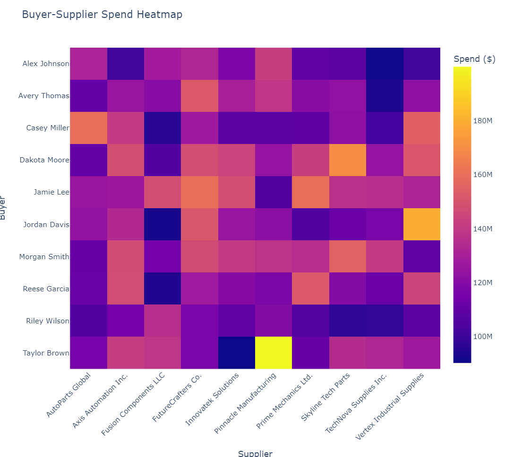

# Procurement Spend Analysis

Welcome to the **Procurement Spend Analysis** repository! This project is designed to empower supply chain managers and procurement professionals by leveraging Python-based analytics to optimize spend analysis across suppliers, buyers, and item models. With interactive visualizations, the code provides actionable insights to improve procurement efficiency and decision-making.

---

## **Features**
- **Supplier Spend Analysis**:
  - Bar charts and pie charts to visualize total spend by suppliers and their contribution to overall procurement costs.
- **Item Model Spend Analysis**:
  - Detailed breakdown of spend by item models with bar charts, pie charts, and treemaps.
- **Buyer Analysis**:
  - Bubble charts to understand buyer spending patterns, PO distribution, and supplier relationships.
  - Treemaps to visualize spend by suppliers for individual buyers.
- **Buyer-Supplier Heatmap**:
  - A heatmap showing spending relationships between buyers and suppliers, enabling quick detection of inefficiencies or dependencies.

---

## **Getting Started**

### Prerequisites
Ensure you have the following installed:
- Python 3.8+
- Libraries:
  - `pandas`
  - `plotly`
  - `openpyxl`

You can install the required libraries using the following command:
```bash
pip install pandas plotly openpyxl
```

---

## **File Structure**
```
├── README.md                 # Project documentation
├── procurement_analysis.py   # Main script for data analysis and visualizations
├── data/
│   ├── PO_Report.xlsx        # Input PO data (replace with your own dataset)
├── images/                   # Generated visualizations
│   ├── Spend_By_Supplier.png
│   ├── Buyer_PO_Analysis.png
│   ├── Buyer_Supplier_Heatmap.png
│   ├── Supplier_Spend_By_Buyer_Treemap.png
│   ├── Spend_By_Item_Model.png
│   ├── Spend_By_Item_Model_Pie_Chart.png
│   ├── Spend_By_Item_Model_Treemap.png
```

---

## **How to Use**

### Step 1: Clone the Repository
```bash
git clone https://github.com/Shaanek/spend_analysis.git
cd procurement-spend-analysis
```

### Step 2: Add Your Data
Replace the sample `PO_Report.xlsx` in the `data/` folder with your own Purchase Order data.

### Step 3: Run the Analysis
Execute the Python script to generate visualizations and insights:
```bash
python procurement_analysis.py
```

---

## **Code Overview**

### Data Loading and Preprocessing
The `load_po_data()` function loads the PO data from an Excel file, performs preprocessing, and converts necessary columns (e.g., dates) into the correct formats.

```python
def load_po_data(file_path):
    """
    Load and preprocess PO data.
    Args:
        file_path (str): Path to the PO data file
    Returns:
        pandas.DataFrame: Preprocessed data
    """
```

### Supplier Spend Analysis
Visualizes supplier-related spending patterns using bar charts and pie charts.

#### Example: Spend by Supplier (Bar Chart)
```python
def create_supplier_spend_bar_chart(df):
    """
    Create a bar chart for supplier spend.
    """
    ...
```
Generated Output:


---

### Item Model Spend Analysis
Provides insights into procurement spending by item model.

#### Example: Top 10 Item Models by Spend (Pie Chart)
```python
def create_top_item_models_pie_chart(df):
    """
    Create a pie chart for the top 10 item models.
    """
    ...
```
Generated Output:


---

### Buyer Analysis
Helps identify spending patterns for buyers with bubble charts and treemaps.

#### Example: Buyer Analysis Dashboard (Bubble Chart)
```python
def create_buyer_analysis_chart(df):
    """
    Create a bubble chart for buyer analysis.
    """
    ...
```
Generated Output:


---

### Buyer-Supplier Heatmap
Highlights relationships between buyers and suppliers with a heatmap.

#### Example: Buyer-Supplier Spend Heatmap
```python
def create_buyer_supplier_heatmap(df):
    """
    Generate a heatmap for buyer-supplier relationships.
    """
    ...
```
Generated Output:


---

## **Input Data Format**
Your PO dataset should be in the form of an Excel file with the following columns:
- `PO #` - Purchase order number.
- `PO Amount Due ` - Amount spent.
- `Supplier Name` - Supplier associated with the PO.
- `Buyer` - Buyer responsible for the PO.
- `Item Model Description` - Description of the purchased item model.
- `Po Creation Date` - Date of PO creation.

---

## **Outputs**
All visualizations are saved in the `images/` directory for easy access:
1. Spend by Supplier
2. Supplier Spend Distribution
3. Spend by Item Model
4. Top 10 Item Models by Spend
5. Buyer Analysis Dashboard
6. Buyer-Supplier Spend Heatmap

---

## **Contributing**
Contributions are welcome! Please submit a pull request with your proposed changes or improvements.

---

## **License**
This project is licensed under the MIT License. See the `LICENSE` file for details.

---

## **Contact**
For questions or suggestions, feel free to contact:
- **Your Name**: [srekatpure@gmail.com]

Happy analyzing! 🚀
